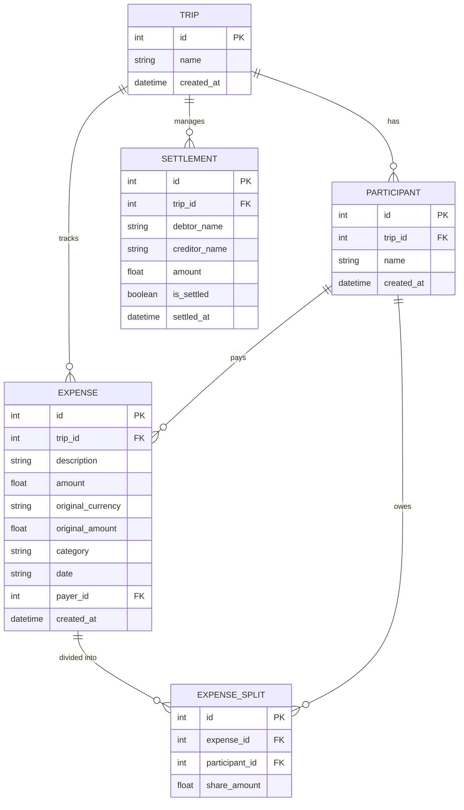

# TripSplit AI — Technical Architecture & Debt Simplification Mathematics

This document provides a deep technical dive into **TripSplit AI**, detailing the system architecture, database design, REST/HTMX API specifications, and the discrete mathematics behind the **Min-Cash-Flow Debt Simplification Algorithm**.

---

## 1. System Architecture & Tech Stack

TripSplit AI is built using the **Hypermedia-Driven Application (HDA)** pattern. Unlike monolithic single-page applications (SPAs) that require heavy JavaScript frameworks (e.g., React, Angular) and duplicate client-side state, TripSplit AI leverages **HTMX** and **Jinja2** to stream pre-rendered HTML fragments over HTTP, paired with a high-performance **FastAPI** backend.

```
┌────────────────────────────────────────────────────────────────────────┐
│                        Client Browser                                  │
│  - Tailwind CSS (Dark/Light mode via class strategy & localStorage)    │
│  - HTMX 1.9.10 (AJAX requests, DOM swaps, target triggers)             │
│  - Minimal JavaScript (Currency preview, Modal toggles, Theme state)   │
└──────────────────┬─────────────────────────────────▲───────────────────┘
                   │ HTTP Requests (hx-post, hx-get) │ HTML Partials / JSON
                   ▼                                 │
┌────────────────────────────────────────────────────────────────────────┐
│                       FastAPI Backend Layer                            │
│  - main.py (Async routing, Form parsers, Validation)                   │
│  - Jinja2Templates (templates/index.html & templates/partials/*.html)   │
│  - Financial Engine (Min-Cash-Flow, Split balances, Badges, Metrics)   │
│  - Gemini Multimodal Vision Parser (google-generativeai SDK)           │
│  - Universal FX Currency Converter (Real-time + Offline fallbacks)     │
└──────────────────┬─────────────────────────────────────────────────────┘
                   │ SQLAlchemy ORM Session Handling
                   ▼
┌────────────────────────────────────────────────────────────────────────┐
│                       Persistence Layer                                │
│  - SQLite Database (`tripsplit.db` via SQLAlchemy 2.0+)                │
│  - Relational Schema: Trip, Participant, Expense, Split, Settlement    │
│  - Cascade Deletion & Foreign Key Integrity                            │
└────────────────────────────────────────────────────────────────────────┘
```

### Core Technologies
- **Backend Framework**: [FastAPI](https://fastapi.tiangolo.com/) (Python 3.10+) for async request processing and OpenAPI documentation.
- **ASGI Server**: [Uvicorn](https://www.uvicorn.org/) for high-throughput HTTP handling.
- **ORM & Database**: [SQLAlchemy](https://www.sqlalchemy.org/) with [SQLite](https://www.sqlite.org/) (zero-config, ACID-compliant local storage).
- **Template Engine**: [Jinja2](https://palletsprojects.com/p/jinja/) for modular, server-rendered dynamic templates.
- **Frontend Interactivity**: [HTMX](https://htmx.org/) for declarative AJAX updates and DOM morphing.
- **Styling & UI**: [Tailwind CSS](https://tailwindcss.com/) with full responsive design and dark/light color palette.
- **Generative AI**: [Google Gemini Flash](https://ai.google.dev/) multimodal vision model for automated receipt digitization.

---

## 2. Relational Database Schema

The database schema is organized around a multi-tenant trip model. All participants, expenses, and settlements are strictly scoped to a `Trip`.



### Schema Invariants
1. **Trip Scoping**: Every query explicitly filters by `trip_id`. When a trip is deleted, cascade rules remove associated participants, expenses, splits, and settlement statuses.
2. **Zero-State Guarantee**: On first launch or database creation, all tables are generated empty. No demo trips or dummy participants are preloaded.
3. **Currency Normalization**: `Expense.amount` stores the canonical normalized value in **INR (₹)**, while `Expense.original_currency` and `Expense.original_amount` store the user-entered input for auditing.

---

## 3. Debt Simplification: Graph Mathematics & Min-Cash-Flow Algorithm

### 3.1 The Problem: Naive Debt Explosion

In a group trip, participants pay for various group expenses (e.g., dining, cab rides, villa rentals). In a naive bookkeeping model:
- If traveler $A$ pays ₹3,000 for a meal shared equally with $B$ and $C$, two direct debt obligations are created: $B \to A$ (₹1,000) and $C \to A$ (₹1,000).
- If traveler $B$ later pays ₹1,500 for groceries shared with $A$ and $C$, two more edges are created: $A \to B$ (₹500) and $C \to B$ (₹500).

As expenses accumulate across $n$ participants and $k$ shared events, the debt graph $G = (V, E)$ becomes densely connected:
$$\text{Naive Pairwise Debt Count} = |D| \times |C| \le \frac{n(n-1)}{2} = \mathcal{O}(n^2)$$
where $D$ is the set of debtors and $C$ is the set of creditors. For a group of 10 people, this can require up to 45 separate bank or UPI transfers, leading to confusion, duplicate transactions, and settlement friction.

---

### 3.2 Net Balance Invariant

Instead of tracking pairwise historical transactions, TripSplit AI computes each participant's **Net Cash Position**.

Let $V = \{v_1, v_2, \dots, v_n\}$ be the set of participants. For each participant $v_i \in V$:
$$\text{Paid}(v_i) = \sum_{e \in \text{Expenses}, \text{Payer}(e) = v_i} \text{Amount}(e)$$
$$\text{Owed}(v_i) = \sum_{s \in \text{Splits}, \text{Beneficiary}(s) = v_i} \text{Share}(s)$$
$$\text{Net}(v_i) = \text{Paid}(v_i) - \text{Owed}(v_i)$$

#### Fundamental Conservation Invariant
In any closed financial system where every expense is fully distributed among beneficiaries:
$$\sum_{i=1}^{n} \text{Paid}(v_i) = \sum_{i=1}^{n} \text{Owed}(v_i) = \text{Total Group Spend}$$
$$\implies \sum_{i=1}^{n} \text{Net}(v_i) = 0$$

This zero-sum conservation invariant guarantees that total credit always equals total debt.

---

### 3.3 Partitioning the Graph

We partition the participant set $V$ into three disjoint subsets with numerical tolerance $\epsilon = 0.01$:

1. **Debtors ($D$)**: Participants who spent less than their fair share and owe money into the group pool:
   $$D = \{v \in V \mid \text{Net}(v) < -\epsilon\}$$
2. **Creditors ($C$)**: Participants who fronted payments and must receive money from the pool:
   $$C = \{v \in V \mid \text{Net}(v) > \epsilon\}$$
3. **Settled ($Z$)**: Participants whose balance is balanced within rounding precision:
   $$Z = \{v \in V \mid |\text{Net}(v)| \le \epsilon\}$$

---

### 3.4 The Greedy Min-Cash-Flow Algorithm

The Min-Cash-Flow algorithm matches the largest debtor with the largest creditor iteratively. This greedy strategy eliminates at least one participant (either reducing the debtor's debt to ₹0 or fully reimbursing the creditor) in every step.

```
Algorithm: Greedy Min-Cash-Flow
Input: Net balance dictionary {participant: net_balance}
Output: List of optimized transfers [(debtor, creditor, amount)]

1. Extract debtors D = [[name, -net]] for net < -0.01
2. Extract creditors C = [[name, net]] for net > 0.01
3. Sort D descending by amount owed
4. Sort C descending by amount to receive
5. Initialize transfers = []
6. While D is not empty and C is not empty:
     a. debtor, debt = D[0]
     b. creditor, credit = C[0]
     c. transfer_amount = min(debt, credit)
     d. Append (debtor, creditor, round(transfer_amount, 2)) to transfers
     e. D[0].debt -= transfer_amount
     f. C[0].credit -= transfer_amount
     g. If D[0].debt < 0.01: remove D[0]
     h. If C[0].credit < 0.01: remove C[0]
     i. Re-sort or maintain heap/pointers
7. Return transfers
```

#### Upper Bound on Number of Transfers
Since each transfer completely settles either one debtor, one creditor, or both simultaneously:
$$\text{Number of Transfers} \le |D| + |C| - 1 \le |V| - 1 = n - 1$$

Thus, for a group of $n = 10$ travelers:
- **Naive transactions**: up to 45 transfers.
- **Min-cash-flow optimized**: at most **9 transfers**.

#### Mathematical Transaction Savings Metric
$$\text{Transactions Saved} = \max(0, \text{Naive Pairwise Count} - \text{Optimized Transfer Count})$$
$$\text{Efficiency Gain \%} = \left( \frac{\text{Transactions Saved}}{\text{Naive Pairwise Count}} \right) \times 100\%$$

---

## 4. Gamified Analytics Engine

TripSplit AI computes real-time behavioral insights and traveler badges from group transaction metrics:

| Metric / Badge | Condition / Formula | Purpose |
|---|---|---|
| **Group Spend Velocity** | $\text{Burn Rate} = \frac{\text{Total Spend}}{\text{Trip Duration (days)}}$ | Health meter with dynamic color bar indicating spend speed. |
| 👑 **Big Spender** | $\max_{v \in V}(\text{Paid}(v))$ | Recognizes the traveler who paid the largest cumulative sum. |
| 🛡️ **Budget Boss** | $\min_{v \in V}(\text{Paid}(v))$ with expenses logged | Highlights cautious spending habits. |
| ⚡ **Frequent Swiper** | $\max_{v \in V}(\text{Count of Expenses Paid})$ | Highlights the most active group purchaser. |
| ⚖️ **Fair & Square** | $\min_{v \in V}(|\text{Net}(v)|)$ | Acknowledges closest to exact zero balance. |

---

## 5. Universal Currency Normalization

TripSplit AI provides multi-currency conversion normalizing all inputs to **INR (₹)**.

### Exchange Rate Hierarchy
1. **Real-time FX**: Fetches exchange rates from `https://open.er-api.com/v6/latest/INR` with caching.
2. **Resilient Fallback Ratios**: If the live network is unavailable or offline, the system safely falls back to standard baseline ratios:
   - $1\text{ USD} = 83.50\text{ INR}$
   - $1\text{ EUR} = 90.50\text{ INR}$
   - $1\text{ GBP} = 106.50\text{ INR}$
   - $1\text{ INR} = 1.00\text{ INR}$

### Split Calculation with Cent/Paise Invariance
When splitting an amount $A$ among $m$ participants:
$$\text{Base Share} = \text{round}\left(\frac{A}{m}, 2\right)$$
$$\text{Remainder} = A - (\text{Base Share} \times m)$$
The remainder (fractions of a paisa) is assigned to the first split beneficiary so that:
$$\sum_{i=1}^{m} \text{Share}_i \equiv A \quad (\text{Exact to the last paisa})$$

---

## 6. API Endpoint Reference

All endpoints return HTML partials for HTMX requests or JSON payloads when queried programmatically.

| Method | Endpoint | Description | Return Type |
|---|---|---|---|
| `GET` | `/` | Application shell with trip selector and active trip dashboard | `text/html` (Full Page) |
| `GET` | `/api/dashboard` | Active trip dashboard fragment | `text/html` (HTMX Partial) |
| `POST` | `/api/trips` | Create a new trip | `text/html` (HTMX Partial) |
| `POST` | `/api/trips/select` | Switch currently active trip context | `text/html` (HTMX Partial) |
| `POST` | `/api/trips/delete` | Delete a trip and cascade all related data | `text/html` (HTMX Partial) |
| `POST` | `/api/participants` | Add a traveler to the active trip | `text/html` (HTMX Partial) |
| `POST` | `/api/participants/delete` | Remove a traveler from the active trip | `text/html` (HTMX Partial) |
| `POST` | `/api/expenses` | Add manual expense (with standard or custom category) | `text/html` (HTMX Partial) |
| `POST` | `/api/expenses/scan-receipt` | Upload receipt image to Gemini AI for vision parsing | `text/html` (HTMX Partial) |
| `POST` | `/api/expenses/confirm-receipt` | Confirm and commit AI-parsed receipt into database | `text/html` (HTMX Partial) |
| `POST` | `/api/expenses/delete` | Delete an expense and recompute net shares | `text/html` (HTMX Partial) |
| `POST` | `/api/settlements/toggle` | Toggle payment checkmark for a debt transfer | `text/html` (HTMX Partial) |
| `GET` | `/api/export/csv` | Download complete trip expense ledger as CSV | `text/csv` (File Download) |
| `GET` | `/api/fx/rates` | Return current exchange rates against INR | `application/json` |
